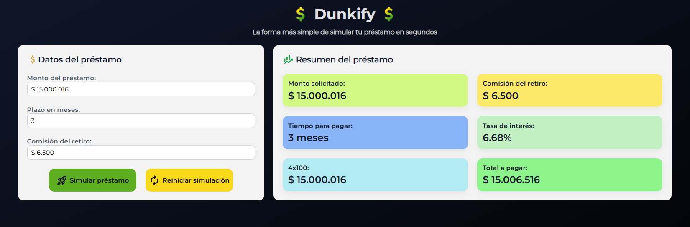

# 💰 Dunkify - Simulador de Préstamos

Dunkify es una aplicación web interactiva que permite simular un préstamo ingresando el monto solicitado, el plazo en meses y la comisión de retiro. Calcula automáticamente el total a pagar y otros datos clave del préstamo. Ideal para quienes desean visualizar fácilmente el impacto de un crédito antes de tomar una decisión.

---

## 🖼️ Vista previa

---

## 🚀 Funcionalidades

- 💸 Ingreso de monto solicitado con formato de moneda
- 📆 Selección del plazo en meses (de 1 a 24)
- 📊 Cálculo automático de:
  - Comisión por retiro
  - 4x1000
  - Interés bancario fijo (6.68%)
  - Total a pagar
- 🧮 Máscara en inputs para mejor experiencia de usuario
- 🖼️ Interfaz moderna y responsiva

---

## 🛠️ Tecnologías utilizadas

- **React 19**
- **Vite** (para desarrollo rápido)
- **TypeScript**
- CSS puro con estilos personalizados
- Tipografías personalizadas (Montserrat)
- Imágenes SVG para íconos visuales

---

## 📦 Instalación

1. Clona el repositorio:

\`\`\`bash
git clone https://github.com/tu-usuario/dunkify.git
cd dunkify
\`\`\`

2. Instala las dependencias:

\`\`\`bash
npm install
\`\`\`

3. Inicia la app en modo desarrollo:

\`\`\`bash
npm run dev
\`\`\`

4. Abre tu navegador en `http://localhost:5173`

---

## 📁 Estructura de carpetas (resumen)

\`\`\`
src/
│
├── assets/ # Íconos e imágenes
├── components/ # Componentes React (LoanDetailsForm, LoanSummary)
├── common/ # Constantes y utilidades compartidas
├── app/ # Entrada principal (App.tsx)
├── index.css # Estilos globales
└── main.tsx # Punto de entrada de React
\`\`\`

---

## 📌 Notas adicionales

- La app está optimizada para funcionar bien en resoluciones medianas y grandes.
- El interés es fijo por ahora, pero se puede ajustar fácilmente para simular tasas variables.

---

## 🤝 Contribuciones

¡Son bienvenidas! Abre un issue o envía un pull request si quieres mejorar la app.

---

## 📄 Licencia

MIT © [DUNK DEV]
